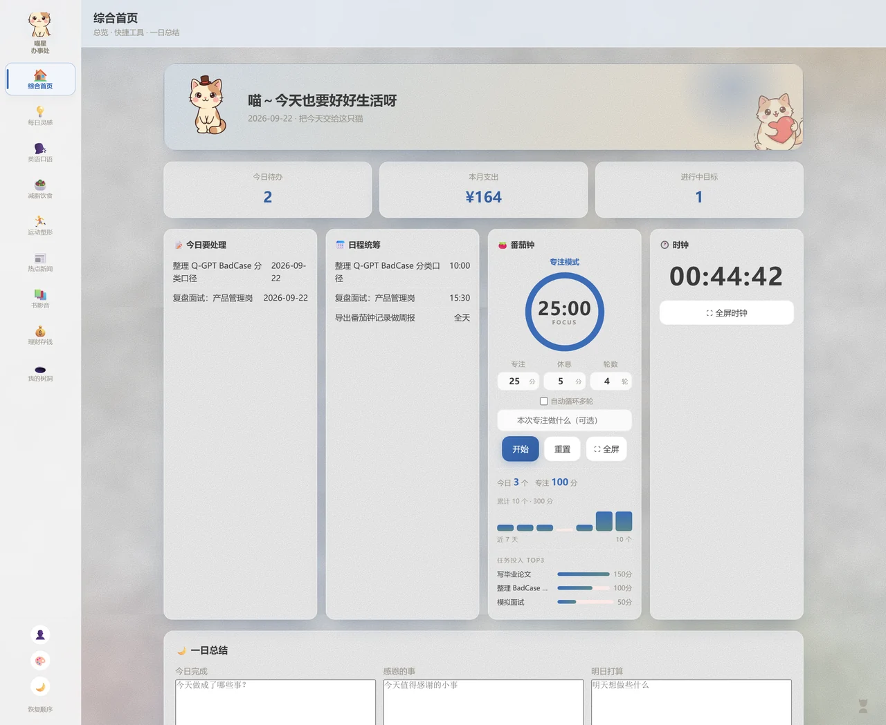
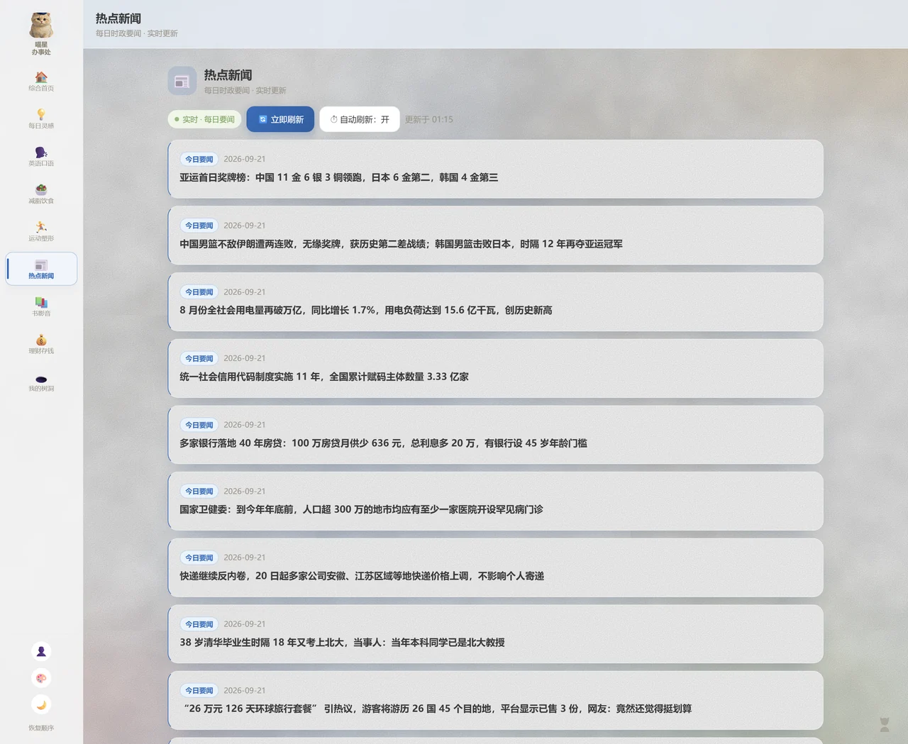
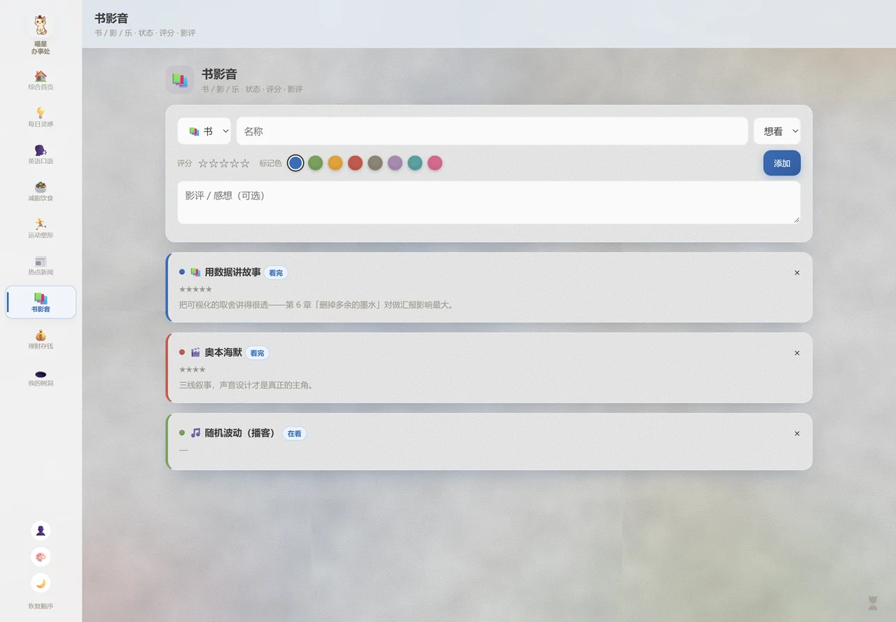
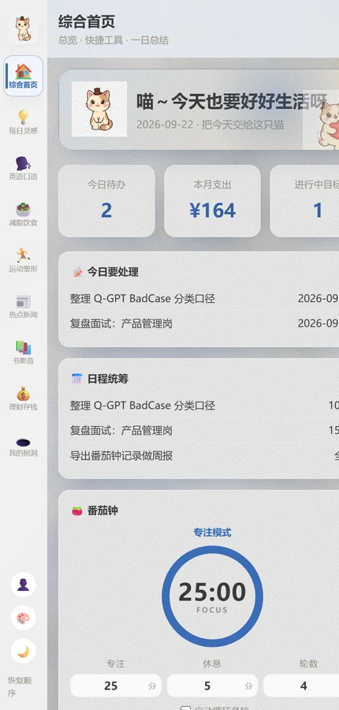
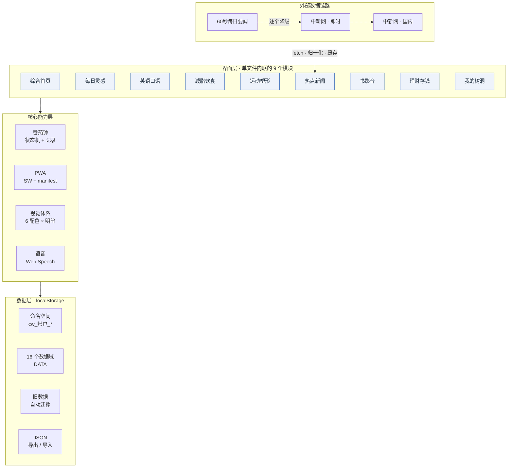

<div align="center">

# 🐱 喵星驻地球办事处

**一个把日程、习惯、饮食、专注、理财和资讯收进同一屏的个人生活数据工作台**

数据全部存在你自己的浏览器里，不上传、不联网也照常用


</div>

---

## 这是什么

日程在日历里、打卡在习惯 App 里、记账在另一处、观影记录散在备忘录里——数据彼此看不见，也不属于自己。

这个项目把它们合到一个页面：**9 个模块、16 个数据域**，全部收在一个 117KB 的单文件里。双击就能用，也能挂在任何静态托管上；数据只落在本地 `localStorage`，换设备靠导出的 JSON 备份。

自我约束只有两条，但贯穿了所有设计取舍：

1. **零依赖单文件** —— 无框架、无构建、无后端，所有 CSS / JS / SVG 内联
2. **数据归用户** —— 不做服务端账号，多账户是本地账户，配上访问锁与备份还原

## 界面预览

> 截图内容为演示用示例数据。

**综合首页** —— 待办聚合、日程、番茄钟（含专注统计与任务归因）、时钟、一日总结收在一屏



**热点新闻** —— 打开即联网抓取，三个公开源逐个降级，带实时状态徽标与更新时间



**书影音** —— 书 / 影 / 乐三类记录，状态、星级评分、颜色标记与影评



**移动端** —— 响应式布局，可添加到主屏全屏使用（PWA）



## 功能

| 模块 | 说明 |
| :-- | :-- |
| 🏠 综合首页 | 今日待办聚合、日程统筹、番茄钟、全屏时钟、一日总结、便利填写 |
| 💡 每日灵感 | 励志金句 + 灵感随手记 |
| 🗣️ 英语口语 | 29 个雅思高频话题，每日推送三题，英文原题呈现，中英语音跟读 |
| 🥗 减脂饮食 | 31 条常见食物热量表，录入即自动换算当日摄入、目标与剩余 |
| 🏃 运动塑形 | 运动打卡、习惯养成（打卡/计数 + 近 7 天点阵）、睡眠与体重趋势 |
| 📰 热点新闻 | 3 个公开数据源实时抓取，逐个降级 + 字段归一化 + 离线兜底 |
| 📚 书影音 | 书 / 影 / 乐分类，想看/在看/看完状态，星级评分、颜色标记、影评 |
| 💰 理财存钱 | 收支流水、月度预算与消耗进度可视化 |
| 🕳️ 我的树洞 | 心愿、带里程碑的目标、好友生日自动倒数、待买清单、可附图的心情碎碎念 |

### 番茄钟（本项目的核心工具）

| 能力 | 说明 |
| :-- | :-- |
| 自定义节奏 | 专注 / 休息时长、循环轮数均可调，配置被持久化 |
| 自动循环多轮 | 到点自动接续下一阶段，跑满全部轮次后自动收工 |
| 全屏专注 | 大号圆环 + 超大倒计时，横竖屏自适应，与首页共享同一套计时状态 |
| 提醒 | 阶段结束三音和弦响铃（Web Audio 合成）+ 手机振动 |
| 使用记录 | 每跑完一个专注阶段落一条记录，带**任务维度** |
| 统计 | 当日个数与分钟、累计、近 7 天柱状图、**任务投入 TOP 排行** |
| 状态持久化 | 切模块、刷新、关页面后回来仍接着跑 |

## 技术架构



### 数据模型

所有数据以 `cw_<账户id>_<域>` 为键存于 `localStorage`，共 16 个域：

| 域 | 类型 | 内容 |
| :-- | :-- | :-- |
| `schedule` | 数组 | 日程待办（标题、日期、时间、完成态） |
| `habits` | 数组 | 习惯定义 + `records[日期]` 打卡记录 |
| `pomo` | 数组 | 专注记录 `{date, kind, min, task, at}` |
| `health` | 对象 | `records[]`：睡眠、体重趋势 |
| `budget` | 对象 | 月度预算总额 |
| `finance` | 数组 | 收支流水（类型、金额、备注、日期） |
| `diet` | 数组 | 饮食记录（食物、热量、餐次） |
| `media` | 数组 | 书影音（类型、状态、评分、标记色、影评） |
| `goal` | 数组 | 目标 + `milestones[]` 里程碑 |
| `mood` | 数组 | 碎碎念（文本 + 压缩后的图片） |
| `birthday` | 数组 | 好友生日，用于倒数 |
| `shopping`/`wish`/`idea` | 数组 | 待买清单 / 心愿 / 灵感 |
| `english` | 数组 | 自添加的练习句 |
| `news` | 数组 | 资讯缓存兜底 |

### 几个值得说的设计决策

**1. 番茄钟状态存「结束时刻」而不是「已流逝秒数」**

切到别的模块再回来时专注不能断。做法是把状态写进 `localStorage`，但存的是**本阶段结束的时间戳 `endAt`**，恢复时用 `endAt - Date.now()` 反算剩余秒数——天然精确，不受页面卡顿或后台节流影响。恢复分三种情况：还没跑完就接着跑；刚跑完（10 分钟内）结算该阶段但不自动续跑，避免静默记一堆番茄；超过 24 小时则弃用且不补记，不污染统计。

**2. 全屏浮层不新起计时器**

全屏专注和首页共用同一套状态，通过 `setTime() / setBtn() / paintRing() / renderMode()` 这几个同时写两处的助手同步；浮层按钮只是代理去点首页按钮。这样任何时刻两边的倒计时、轮次、暂停态都严格一致。

**3. 多源抓取逐个降级**

资讯接口可用性不稳，于是三个源依次尝试，字段统一归一化、去 HTML 标签清洗；本地缓存 + 定时刷新 + 页面回焦补刷，断网自动回退内置数据集，保证页面不空白。

**4. 日期一律本地时区**

早期版本用 `toISOString().slice(0,10)` 取日期，在 UTC+8 下会导致北京时间 0–8 点的记录被算到前一天。现在统一走本地时区函数。

**5. 纯前端下的数据归属**

没有后端，但用户仍需「换设备」「区分账户」。所以做了 localStorage 命名空间隔离、旧数据自动迁移、访问密码（本地简单哈希，防误开非强加密）、JSON 导出导入备份。

## 目录结构

```
life-workspace.html            主文件 · 单文件应用（约 1500 行）
deploy-site/                   部署目录 · 含 PWA 的 manifest / sw.js / 图标
tools/
  smoke-test.js                回归断言（Node vm + 最小 DOM 桩，12 组）
  news-check.js                资讯源可达性与解析验证
  capture-screens.js           用 CDP 驱动无头浏览器批量截图
cat-images/                    网页用图（WebP，384px）
cat-workspace-miniprogram/     微信小程序端（6 个页面，独立交付物）
assets/                        README 预览图
```

## 快速开始

**只想用**：浏览器打开 `life-workspace.html` 即可（`file://` 下 PWA 注册会自动跳过）。

**想验证 PWA 安装与离线能力**，需要一个 http 环境：

```bash
cd deploy-site && python -m http.server 8080
# 然后访问 http://localhost:8080
```

**手机上**：Safari 用「分享 → 添加到主屏幕」，Chrome 用菜单里的「安装应用」，即可全屏启动、离线可用。

## 部署

推送到 `main` 后由 GitHub Actions 自动把 `deploy-site/` 发布到 GitHub Pages：

- 工作流：`.github/workflows/deploy-pages.yml`
- 其中包含一步 `cp life-workspace.html deploy-site/index.html`，保证线上内容永远与主文件一致，不会忘记同步

任何静态托管都能用同一份产物（`deploy-site/` 目录）。

## 回归测试

改完必跑，两条命令：

```bash
node tools/smoke-test.js    # 12 组断言，约 1 秒
node tools/news-check.js    # 需联网，验证资讯源真实可达
```

`smoke-test.js` 的做法是**手写最小 DOM 桩 + Node `vm` 沙箱**，把整个应用跑在无浏览器环境里，覆盖：

| 组 | 覆盖内容 |
| :-- | :-- |
| 1 | 9 个模块全部渲染不报错 |
| 2 | 番茄钟全流程：改时长 → 重置 → 开始 → 跑满 → 阶段切换 |
| 3 | 自动循环多轮：跑满 2 轮并正确收工 |
| 4 | 配色弹窗结构（6 套、无名称残留） |
| 5–7 | 模块清单、模块合并、已移除功能不再出现 |
| 8 | 习惯与健康**真实写入** `localStorage` 并校验字段 |
| 9 | 全屏浮层的显示 / 参数同步 / 关闭 / 切换后清理 |
| 10 | 专注记录落盘字段正确、休息不记录、统计与任务排行渲染 |
| 11 | **切模块后状态接回**、暂停保留、恢复后仍能正常完成并记录 |
| 12 | 任务维度：任务名入记录、进候选列表、一日总结归因 |

这套断言是这个项目能持续迭代的前提——尤其在没有浏览器可用的环境里，它是唯一能证明「改动没把别的功能弄坏」的手段。

## 关于开发方式

这是一个 **AI 原生（AI-native）开发实践**：需求定义、架构取舍与验收标准由我制定，AI 承担代码实现、内容数据集结构化（雅思题库、食物热量表、资讯兜底数据）与接口可行性探测。

关键不在于「用了 AI」，而在于**给 AI 的产出设了质量闸门**：任何产出必须通过上面那套回归断言与语法、结构校验才允许合入。这套机制在迭代中抓出了三类隐蔽缺陷，其中一个很典型——番茄钟的计时器变量放在闭包里，每次回到首页都会重建并新建一个 `setInterval`、旧的永不清理，表现是「不报错，但反复切页后倒计时越来越快」。

## 已知限制

诚实说明，避免误解：

- **「AI 一日总结」是本地规则聚合，不是大模型调用**。它把当天的待办、专注、习惯、支出按模板归纳成一段文字，没有网络请求
- **数据只存在浏览器本地**，没有跨设备同步；多账户是本地账户，不是服务端账号
- **访问密码是本地简单哈希**，用于防止他人误开，不等同于加密，敏感数据请勿存放
- **资讯依赖第三方公开接口**，其可用性与准确性不由本项目控制
- **iOS Safari 对语音识别支持有限**，麦克风按钮会自动隐藏
- 微信小程序端为独立雏形，与 Web 端功能未完全对齐

## Roadmap

- [ ] 专注统计加深：**时段分布**（几点最容易进入专注）、周/月视图、连续天数 streak、中断率
- [ ] 「AI 一日总结」接入大模型，升级为真实生成，并扩展 AI 周报 / 专注教练
- [ ] 专注与待办联动：从待办里选一项开跑，完成后自动勾选并把时长计入该项
- [ ] 专注记录导出 CSV，便于配合 Python / Pandas 做行为分析
- [ ] 番茄钟与习惯、健康、支出数据整合成一张可分享的周报图
- [ ] 修正跨零点归属：专注跨过午夜时记录会算在前一天，需按「完成时刻」归属

## 许可

个人项目，仅供学习交流。如需引用其中代码，注明出处即可。
